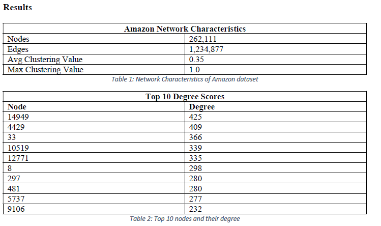
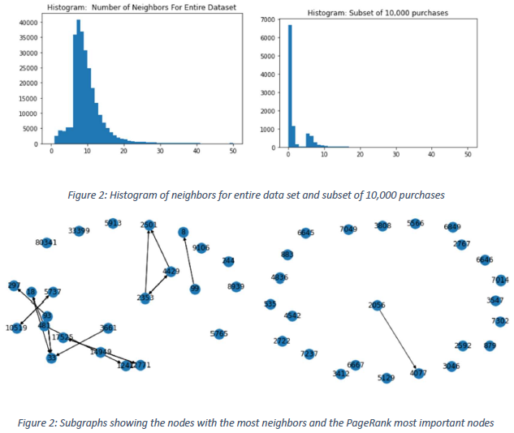

# Amazon Content-Based Recommendation System

## Dataset from: http://snap.stanford.edu/data/amazon0302.html

## Report: https://github.com/OdysseyV/Amazon_Recommendation_System/blob/main/Report.pdf

### Recommending Products 
After we identified the popular products, we then created our recommendation
system. We created a Content-based recommendation system that uses a history of previously
bought items to recommend additional products. This involves keeping track of individual
purchases, which allows the shop owner to later update the main graph with the number of items
purchased. The code for this individual tracking and recommendation system can be seen in the
attached jupyter notebook under the heading, “Create User Profile.”

Additionally, we created an algorithm to get around the long runtime of traditional
clustering algorithms. In this algorithm, the store owner would enter in the ID for their most
popular product, and a cluster of nodes would be built around it. The way this works is using the degree of neighboring nodes, and a greedy approach. A new graph is created, starting with the
item that the user specifies. After that, the surrounding items are added. If the desired number of
items is still not reached, it begins to add on nodes based on the highest degree of each node.
Code for this can be seen in the attached jupyter notebook under the heading, “Store Owner
Recommendation System.”
### Data Characteristics

### Graphs
